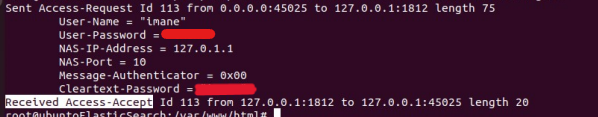

# Securing-Enterprise-Access
### References: 
https://www.cisco.com/c/en/us/td/docs/routers/ios/config/17-x/sec-vpn/b-security-vpn/m_sec-cfg-radius.html#GUID-F1255174-62BA-483C-B48A-09B8E6996760

https://www.watchguard.com/help/docs/fireware/12/fr-FR/Content/fr-FR/authentication/radius_server_auth_about_c.html
## Elevating Security: The Power of 802.1X, EAP, and RADIUS in the Enterprise
Enterprise security mode, requires a __RADIUS__ server for __Authentication__, __Authorization__, and __Accounting__ __(AAA)__: 
### FreeRADIUS is the underlying AAA server that handles authentication and authorization, while DaloRADIUS is a web interface that simplifies the management and configuration of a FreeRADIUS server through a graphical user interface.
<a href="https://github.com/lirantal/daloradius/releases/tag/1.2">Install DaloRadius </a>
### Install FreeRADIUS Server in ubunto system: 
###### sudo apt -y install freeradius freeradius-mysql freeradius-utils
### Installation of PHP libraries, MariaDB server, configuration of the database server, creation of the database. Same procedure in: 

https://github.com/ImaneLamriui/SimpleSamlPHP
### The combination of 802.1X, EAP, and RADIUS is employed to establish robust and secure network access control:
__802.1X__ is a network access control standard that requires user or device authentication before granting access to the network. It establishes the framework for authentication at the data link layer.
__EAP__ is used to encapsulate authentication messages between the client and the authentication server.
__RADIUS__ is commonly employed for communication between the authenticator (for example a switch) and the authentication server.", __RADIUS__ only encrypts the user's password, is a more commonly implemented protocol and is compatible with a wide range of devices and services, including remote access services, wireless networks (Wi-Fi), and VPN."

## The authentication process typically involves the following steps:
__Initialization__: The supplicant initiates the connection to the network, and the authenticator places the port in a "closed" or unauthorized state.

__EAPOL__: (Extensible Authentication Protocol over LAN): The supplicant and authenticator exchange EAPOL messages to initiate the authentication process.

__Identity Verification__: The supplicant often sends an EAP-Request/Identity message to the authenticator, indicating the identity of the user or device. The authenticator may respond with an EAP-Response/Identity message.

__Authentication Server Interaction__: The authenticator forwards the identity information to the authentication server. The authentication server then interacts with the supplicant to verify the identity. This interaction may involve challenges, such as the presentation of a username and password, a digital certificate, or other authentication credentials.

__Authentication Decision__: Based on the information provided by the supplicant and the authentication server's verification, an authentication decision is made. If the supplicant is successfully authenticated, the authentication server informs the authenticator.

__Network Access Granted__: If the authentication is successful, the authenticator changes the port state to "open" or authorized, allowing the supplicant access to the network.

__Secure Data Transfer__: With the supplicant successfully authenticated and authorized, secure data transfer can occur over the network.

### I have added a new user 'Imane', to the database.
As I am in a testing environment, I have chosen the password type as 'cleartext-password,' but it is not a good practice.

### I send a request with the new user to the default NAS access point, which could be a Wi-Fi access point, switch, or similar. 
__RADIUS__ interacts with a network device known as __NAS__ (Network Access Server), which can be, for example, a Wi-Fi access point, a switch, or another similar device. The term 'default __NAS__ access point' refers to the default __NAS__ used in the process.
The process involves sending a request to create a new user in __RADIUS__ environment, where a __NAS__ is utilized as the access point to the network. This process is essential for MANAGING user access to the network and ensuring proper authentication.

##### NAS, or 'Network Attached Storage,' enables users to store and share data over a local network (LAN) or even over the Internet. It is essentially a file server. In addition to file storage, some NAS devices can provide additional functions such as media servers, print servers, and additional applications through the installation of apps or software packages. 
##### NAS devices typically come with built-in security features, including the ability to set user permissions and encrypt data to protect privacy and security, provides an efficient and centralized storage solution for both home and business environments, facilitating the management and access of data across the network.

